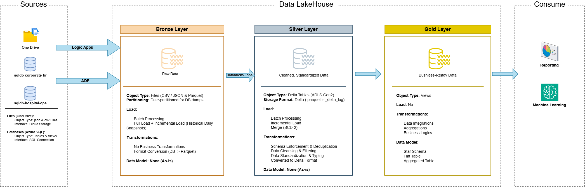

# HealthOne Enterprise Lakehouse

An end-to-end healthcare data engineering project built on Microsoft Azure. The project demonstrates how hospital operational data and corporate HR data can be collected, stored, transformed, and prepared for analytics using Azure Data Factory, Azure Data Lake Storage Gen2, Azure Databricks, Delta Lake, Azure SQL Database, Logic Apps, and Unity Catalog.

The solution follows the **Medallion Architecture**:

**Source Systems → Bronze → Silver → Gold → Analytics**

---

## Table of Contents

- [Project Overview](#project-overview)
- [Architecture](#architecture)
- [Technology Stack](#technology-stack)
- [Azure Resources](#azure-resources)
- [Data Lake Structure](#data-lake-structure)
- [Source Databases](#source-databases)
- [Data Ingestion](#data-ingestion)
- [Azure Logic Apps](#azure-logic-apps)
- [Azure Data Factory](#azure-data-factory)
- [Azure Databricks](#azure-databricks)
- [Bronze Layer](#bronze-layer)
- [Silver Layer](#silver-layer)
- [Gold Layer](#gold-layer)
- [Incremental Loading](#incremental-loading)
- [SCD Type 2](#scd-type-2)
- [Unity Catalog](#unity-catalog)
- [Monitoring and Alerts](#monitoring-and-alerts)
- [Repository Structure](#repository-structure)
- [Setup Guide](#setup-guide)
- [Security Notes](#security-notes)
- [Key Learning Outcomes](#key-learning-outcomes)

---

## Project Overview

The **HealthOne Enterprise Lakehouse** is designed to bring healthcare operations and corporate HR data into one cloud-based data platform.

The project handles data from two main areas:

- Hospital operations
- Corporate HR and payroll

The platform supports:

- Azure SQL DB data ingestion
- OneDrive file ingestion
- Incremental data processing
- Bronze, Silver, and Gold data layers
- Data cleaning and validation
- SCD Type 2 historical tracking
- Delta Lake tables
- Watermark-based incremental processing
- Business-ready Gold views
- Azure managed identities
- Unity Catalog external locations
- Pipeline monitoring and email alerts

The main goal is to create a clean and maintainable data platform that can support reporting and analytics.

---

## Architecture

The project uses a cloud-based Medallion Architecture.



### Medallion Layers

| Layer | Purpose |
|---|---|
| Bronze | Stores raw data with minimum changes |
| Silver | Cleans, validates, standardizes, and historizes data |
| Gold | Provides business-ready fact and dimension views |
| Metadata | Stores pipeline control information such as watermarks |
| Test | Used for testing and validation |

---

## Technology Stack

| Technology | Purpose |
|---|---|
| Azure Resource Group | Resource management |
| Azure Data Lake Storage Gen2 | Central data lake |
| Azure SQL Database | Operational source databases |
| Azure Data Factory | SQL ingestion and pipeline orchestration |
| Azure Logic Apps | OneDrive file ingestion |
| Azure Databricks | Data transformation |
| Apache Spark | Distributed data processing |
| Delta Lake | Reliable Silver data storage |
| Unity Catalog | Data governance and access control |
| Azure Managed Identity | Secure service-to-service authentication |
| GitHub | Source control |
| Parquet | Bronze data format |

---

# Azure Resources

All major Azure resources are deployed in **Central India**.

### Resource Group

```text
Name: rg-healthone-lakehouse-centralindia
Location: Central India
```

### Storage Account

```text
Name: sthealthonelakehouseci
Location: Central India
```

### Azure SQL Server

```text
Server:
sql-healthone-lakehouse-central-india.database.windows.net

Location:
Central India
```

### Logic App

```text
Name:
la-healthone-onedrive-ingest-central-india

Type:
Consumption

Pricing:
Pay-per-execution
```

### Azure Data Factory

```text
Name:
adf-healthonelakehousecentralindia

Location:
Central India
```

### Azure Databricks

```text
Workspace:
dbw-healthone-lakehouse-ci

Location:
Central India

Workspace Type:
Hybrid
```

### Databricks Compute

```text
Name:
cmp-healthone

Runtime:
17.3 LTS

Node Type:
Standard_D4ds_v4

Driver:
Single node

Auto Termination:
15 minutes

Photon:
Disabled
```

---

# Data Lake Structure

The ADLS Gen2 storage account uses separate containers for different stages of the platform.

```text
sthealthonelakehouseci
│
├── bronze/
│   ├── onedrive_landing/
│   └── SQL source data
│
├── silver/
│   └── Cleaned and historized Delta data
│
├── gold/
│   └── Business-ready analytical views
│
├── metadata/
│   └── Pipeline control and metadata
│
├── checkpoints/
│   └── Streaming/checkpoint information
│
└── test/
    └── Test and validation data
```

### Bronze

Raw source data is stored with very limited changes.

### Silver

Data is cleaned, validated, standardized, and stored as Delta tables.

### Gold

The Gold layer exposes business-friendly dimensions and facts for analytics.

### Metadata

The metadata layer contains the Bronze-to-Silver watermark table used to control incremental processing.

### Test

Used for validation and test data.

---

# Source Databases

The platform works with two Azure SQL databases.

## Hospital Operations

```text
Database:
sqldb-healthone-ops
```

Main tables include:

- admissions
- appointments
- billing
- doctors
- hospitals
- patients
- departments

## Corporate HR

```text
Database:
sqldb-corporate-hr
```

Main tables include:

- employees
- payroll
- hospitals
- departments

The repository contains sample data for multiple days to demonstrate incremental changes.

---

# Data Ingestion

There are two main ingestion paths.

### SQL to ADLS

```text
Azure SQL Database
        |
        v
Azure Data Factory
        |
        v
ADLS Gen2 Bronze
```

### OneDrive to ADLS

```text
OneDrive
   |
   v
Azure Logic Apps
   |
   v
ADLS Gen2 Bronze
```

After the Bronze layer is populated:

```text
Bronze
   |
   v
Databricks
   |
   v
Silver
   |
   v
Gold
```

---

# Azure Logic Apps

The Logic App is used to bring files from OneDrive into the Bronze area.

```text
Name:
la-healthone-onedrive-ingest-central-india
```

### Configuration

- Consumption plan
- Pay-per-execution
- OneDrive for Business connector
- Azure Blob Storage connector
- Managed Identity authentication
- Recurrence trigger
- Dhaka timezone (UTC+06:00)
- 30-minute recurrence
- Email notification for errors

The OneDrive source folder is:

```text
healthone-enterprise-onedrive
```

### Flow

```text
Recurrence Trigger
       |
       v
OneDrive for Business
       |
       v
List Files in Folder
       |
       v
For Each File
       |
       v
Get Blob Metadata
       |
       v
Condition
       |
       +---- Success → Continue
       |
       +---- Error → Send Email
```

The Blob Storage connection uses:

```text
Connection:
connection-adls-bronze

Authentication:
Logic Apps Managed Identity
```

---

# Azure Data Factory

Azure Data Factory handles the main SQL-to-ADLS ingestion process.

```text
Name:
adf-healthonelakehousecentralindia
```

### Integration Runtime

```text
Name:
vnet-ir-healthone-managed

Type:
Azure Self-Hosted Integration Runtime
```

---

## ADF Git Branch

```text
feature/sql-to-adls-ingest
```

The ingestion pipelines are located under:

```text
Ingestion/
```

---

## Master Pipeline

```text
PL_Ingest_SQL_to_ADLS_Master
```

### Parameters

```text
ServerName
DatabaseList
StorageAccountName
```

Example:

```text
ServerName:
sql-healthone-lakehouse-central-india.database.windows.net

DatabaseList:
[
  "sqldb-corporate-hr",
  "sqldb-healthone-ops"
]

StorageAccountName:
https://sthealthonelakehouseci.dfs.core.windows.net
```

### Master Pipeline Flow

```text
PL_Ingest_SQL_to_ADLS_Master
            |
            v
     ForEach Database
            |
            v
 PL_Ingest_SQL_to_ADLS_Generic
```

The database list is passed to a `ForEach` activity.

---

# Generic Ingestion Pipeline

```text
PL_Ingest_SQL_to_ADLS_Generic
```

This pipeline is designed so the same logic can ingest multiple databases and tables.

### Parameters

```text
ServerName
DatabaseName
StorageAccountName
```

### Step 1: Get Table List

The pipeline reads the table list from SQL Server.

```sql
SELECT
    t.name AS TableName,
    SCHEMA_NAME(t.schema_id) AS SchemaName
FROM sys.tables AS t
```

### Step 2: ForEach Table

The pipeline loops through the returned tables.

### Step 3: Copy Data

The pipeline copies data from Azure SQL Database into ADLS Gen2.

The current incremental query pattern is:

```sql
SELECT *
FROM <schema>.<table>
WHERE updated_at >= (
    SELECT CAST(MAX(updated_at) AS DATE)
    FROM <schema>.<table>
)
```

The pipeline uses:

```text
Retry: 3
Retry Interval: 180 seconds
```

---

# ADF Linked Services

## Azure SQL Linked Service

```text
Name:
AzureSQL_Generic_LS

Integration Runtime:
vnet-ir-healthone-managed

Authentication:
System-assigned Managed Identity
```

Parameters:

```text
ServerName
DatabaseName
```

## ADLS Gen2 Linked Service

```text
Name:
ADLS_Generic_LS

Integration Runtime:
vnet-ir-healthone-managed

Authentication:
System-assigned Managed Identity
```

Parameter:

```text
StorageAccountName
```

---

# ADF Datasets

## Azure SQL Dataset

```text
AzureSQL_Generic_DS
```

Parameters:

```text
ServerName
DatabaseName
SchemaName
TableName
StorageAccountName
```

## ADLS Gen2 Dataset

```text
ADLS_Generic_DS
```

Parameters include the source/database information required to build the target path.

---

# Bronze File Layout

SQL data is stored in the Bronze layer using a database/table/date structure.

Example:

```text
bronze/
└── sql-healthone-lakehouse-central-india.database.windows.net/
    └── sqldb-healthone-ops/
        └── patients/
            └── Year=2026/
                └── Month=09/
                    └── Day=01/
                        └── dbo_patients.parquet
```

The directory pattern is:

```text
<ServerName>/
<DatabaseName>/
<TableName>/
Year=<yyyy>/
Month=<MM>/
Day=<dd>/
```

The file name pattern is:

```text
<SchemaName>_<TableName>.parquet
```

Example:

```text
dbo_patients.parquet
```

---

# ADF Schedule

The main ingestion trigger is:

```text
Name:
Daily_Ingestion_Trigger

Type:
Schedule

Recurrence:
Every 1 day

Timezone:
Dhaka (UTC+6)
```

---

# Monitoring and Alerts

ADF pipeline failures are monitored using Azure alert rules.

Configured alerts include:

```text
PL_Ingest_SQL_to_ADLS_Master Failure Alert
PL_Ingest_SQL_to_ADLS_Generic Failure Alert
```

### Action Group

```text
Name:
DataOps-Alerts

Short Name:
DataOpsAlert
```

Email notifications are used for pipeline failure events.

---

# Azure Databricks

The Databricks workspace is responsible for the transformation from Bronze to Silver and Silver to Gold.

```text
Workspace:
dbw-healthone-lakehouse-ci
```

The repository is connected to Git and uses sparse checkout for the Databricks folder.

```text
Git Folder:
healthone-enterprise-lakehouse

Sparse Checkout:
Enabled

Cone Pattern:
databricks/
```


---

# Bronze Layer

The Bronze layer contains raw Parquet files loaded from Azure SQL and OneDrive.

The Bronze layer is intentionally kept close to the original source structure.

Examples include:

```text
admissions
appointments
billing
departments
doctors
employees
hospitals
patients
payroll
```

Bronze data is not heavily transformed because it is used as the source for downstream processing.

---

# Silver Layer

The Silver layer contains cleaned and validated Delta tables.

The repository includes baseline and incremental processing.

```text
databricks/
└── 01_silver/
    ├── 01_initial_load/
    └── 02_incremental_load/
```

### Initial Load

Baseline scripts are available for:

- departments
- doctors
- employees
- hospitals
- payroll

### Incremental Load

Incremental scripts are available for:

- admissions
- appointments
- billing
- departments
- doctors
- employees
- hospitals
- patients
- payroll

---

# Data Cleaning

The Silver processing includes common data-quality operations such as:

- Trimming text values
- Lowercasing selected fields
- Standardizing gender values
- Cleaning phone numbers
- Validating email addresses
- Casting IDs to correct types
- Casting dates and timestamps
- Handling missing values
- Removing duplicate business-key/version combinations
- Calculating derived fields such as payroll net pay
- Adding source and audit columns

---

# SCD Type 2

The Silver layer maintains historical changes using **Slowly Changing Dimension Type 2**.

The main control columns are:

```text
valid_from
valid_to
is_current
```

When a record changes:

```text
Old Record
is_current = 0
valid_to = new record start time

New Record
is_current = 1
valid_from = current time
valid_to = NULL
```

This allows the platform to keep historical versions instead of replacing old records.

---

# Incremental Loading

Incremental processing is controlled by a watermark table.

```text
healthone_lakehouse.metadata.watermark_bronze_silver
```

The table stores:

| Column | Purpose |
|---|---|
| table_name | Source table being processed |
| last_watermark | Last successful processing point |
| rows_loaded | Number of rows loaded |
| status | PENDING, RUNNING, SUCCESS, FAILED, etc. |
| started_at | Load start time |
| completed_at | Load completion time |
| error_message | Error information |

Each source table has its own watermark record.

The watermark is updated only after a successful load.

If a load fails, the watermark is not advanced, allowing the process to be retried.

---

# Databricks Setup Scripts

The repository contains setup SQL scripts under:

```text
databricks/00_setup/
```

### Catalog and Schema Setup

```text
01_create_catalog_schemas.sql
```

### Delta Table Setup

```text
02_create_delta_tables.sql
```

### Watermark Setup

```text
03_create_silver_watermark_table.sql
```

These scripts prepare the Databricks environment before the Silver and Gold processing starts.

---

# Gold Layer

The Gold layer provides business-ready analytical views.

```text
databricks/
└── 02_gold/
    ├── gold_dim_view.sql
    └── gold_fact_view.sql
```

The Gold layer follows a simple star-schema style structure.

---

## Gold Dimensions

### dim_hospitals

Provides hospital information such as:

- Hospital name
- Address
- City
- Region
- Capacity
- Established date

### dim_departments

Provides:

- Department
- Hospital relationship
- Created date
- Updated date

### dim_employees

Provides:

- Employee details
- Gender
- Contact information
- Role
- Department
- Hospital
- Hire date
- Salary
- Employment status

### dim_doctors

Combines doctor and employee information.

Provides:

- Doctor
- Employee
- Specialization
- Hospital
- Department
- Contact information
- Employment details

### dim_patients

Provides:

- Patient name
- Date of birth
- Gender
- Contact information
- Blood group
- Hospital

---

# Gold Facts

### fact_appointments

Contains appointment events and derived date fields.

Includes:

- Appointment ID
- Patient
- Doctor
- Hospital
- Appointment date
- Appointment year
- Appointment month
- Status
- Reason

### fact_admissions

Contains patient admission information.

Includes:

- Admission ID
- Patient
- Hospital
- Admission date
- Discharge date
- Ward
- Bed
- Status
- Length of stay
- Current admission flag

### fact_billing

Contains billing information.

Includes:

- Bill ID
- Admission
- Patient
- Amount
- Insurance coverage
- Patient payable amount
- Payment status
- Billing date
- Insurance validation flag

### fact_payroll

Contains employee payroll information.

Includes:

- Payroll ID
- Employee
- Pay period
- Gross pay
- Deductions
- Net pay
- Paid date
- Payment year
- Payment month

---

# Unity Catalog

Unity Catalog is used to organize and control access to the lakehouse data.

### Access Connector

```text
Name:
ac-healthone-lakehouse-ci

Location:
Central India
```

The Access Connector is given the required storage access role.

### Storage Credential

```text
healthone-storageaccount-credentials
```

### External Locations

| Name | Location |
|---|---|
| healthone_lakehouse.bronze | Bronze container |
| healthone_lakehouse_silver | Silver container |
| healthone_lakehouse_gold | Gold container |
| healthone_lakehouse_test | Test container |
| healthone_lakehouse_catalog | Catalog storage |

Example Bronze location:

```text
abfss://bronze@sthealthonelakehouseci.dfs.core.windows.net/
```

---

# Catalog and Schemas

The main Databricks catalog is:

```text
healthone_lakehouse
```

The project uses these schemas:

```text
healthone_lakehouse.bronze
healthone_lakehouse.silver
healthone_lakehouse.gold
healthone_lakehouse.metadata
healthone_lakehouse.test
```

Typical access follows this pattern:

```text
Bronze  → Read
Silver  → Read + Modify
Gold    → Read + Modify
Test    → Read + Modify
Metadata → Controlled access
```

---

# SQL Database Authentication

Azure SQL Database supports both:

- SQL authentication
- Microsoft Entra authentication

For Azure Data Factory managed identity access, the ADF managed identity is created as an external user in each database.

Example:

```sql
CREATE USER [adf-healthonelakehouse-centralindia]
FROM EXTERNAL PROVIDER;

ALTER ROLE db_datareader
ADD MEMBER [adf-healthonelakehouse-centralindia];
```

Public access is enabled for selected networks as required by the project setup.

---

# SQL Database Scripts

The SQL source databases contain DDL and stored procedure scripts.

The project uses separate script groups for the main source areas.

```text
Hospital Operations
    ├── DDL
    └── Stored Procedures

Corporate HR
    ├── DDL
    └── Stored Procedures
```

The repository can be extended with separate SQL script folders for each database to keep source database deployment organized.

---

# Repository Structure

The main repository structure is:

```text
healthone-enterprise-lakehouse/
│
├── databricks/
│   ├── 00_setup/
│   │   ├── 01_create_catalog_schemas.sql
│   │   ├── 02_create_delta_tables.sql
│   │   └── 03_create_silver_watermark_table.sql
│   │
│   ├── 01_silver/
│   │   ├── 01_initial_load/
│   │   │   ├── load_silver_departments_baseline.py
│   │   │   ├── load_silver_doctors_baseline.py
│   │   │   ├── load_silver_employees_baseline.py
│   │   │   ├── load_silver_hospitals_baseline.py
│   │   │   └── load_silver_payroll_baseline.py
│   │   │
│   │   └── 02_incremental_load/
│   │       ├── admissions_incremental_load.py
│   │       ├── appointments_incremental_load.py
│   │       ├── billing_incremental_load.py
│   │       ├── departments_incremental_load.py
│   │       ├── doctors_incremental_load.py
│   │       ├── employeess_incremental_load.py
│   │       ├── hospitals_incremental_load.py
│   │       ├── patients_incremental_load.py
│   │       └── payroll_incremental_load.py
│   │
│   └── 02_gold/
│       ├── gold_dim_view.sql
│       └── gold_fact_view.sql
│
├── datasets/
│   ├── hospital_data_day0_(initial_baseline)/
│   ├── hospital_data_day1/
│   ├── hospital_data_day2/
│   ├── hospital_data_day3/
│   └── hospital_data_day4/
│
├── data_lakehouse_bronze_incremental_data/
│   └── Sample Bronze Parquet data
│
├── docs/ 
│   └── Project documentation and architecture
│
├── README.md
└── Documentation/
    └── Readme.md
```

---

# Setup Guide

The project can be deployed in the following order.

## Step 1: Create Azure Resources

Create:

1. Resource Group
2. Storage Account
3. Azure SQL Server
4. Azure SQL Databases
5. Logic App
6. Azure Data Factory
7. Azure Databricks
8. Key Vault
9. Databricks Access Connector

---

## Step 2: Configure Storage

Create the following containers:

```text
bronze
silver
gold
metadata
checkpoints
test
```

Create the required folders inside the containers.

---

## Step 3: Configure Azure SQL

Create the databases:

```text
sqldb-healthone-ops
sqldb-corporate-hr
```

Run the required DDL scripts and stored procedures.

Enable the required authentication methods.

For ADF managed identity access, create the external user and grant the required database role.

---

## Step 4: Configure Logic Apps

Configure:

```text
OneDrive for Business
        |
        v
Logic Apps
        |
        v
ADLS Gen2 Bronze
```

Set the recurrence schedule to every 30 minutes using the Dhaka timezone.

Configure email error handling.

---

## Step 5: Configure ADF

Create:

```text
vnet-ir-healthone-managed
AzureSQL_Generic_LS
ADLS_Generic_LS
AzureSQL_Generic_DS
ADLS_Generic_DS
```

Then create:

```text
PL_Ingest_SQL_to_ADLS_Master
PL_Ingest_SQL_to_ADLS_Generic
```

Finally configure:

```text
Daily_Ingestion_Trigger
```

---

## Step 6: Configure Databricks

Connect the Git repository to Databricks Repos.

Use sparse checkout for:

```text
databricks/
```

Create the Databricks compute:

```text
cmp-healthone
```

Configure the secret scope and Key Vault integration if key-based ADLS access is used.

---

## Step 7: Configure Unity Catalog

Create:

```text
healthone_lakehouse
```

Create the required schemas.

Then configure:

- Storage credential
- External locations
- Access permissions

---

## Step 8: Run Setup SQL

Run:

```text
databricks/00_setup/01_create_catalog_schemas.sql
databricks/00_setup/02_create_delta_tables.sql
databricks/00_setup/03_create_silver_watermark_table.sql
```

---

## Step 9: Run Silver Baseline

Run the baseline scripts first for the initial dataset.

Then use the incremental scripts for new data.

---

## Step 10: Create Gold Views

Run:

```text
databricks/02_gold/gold_dim_view.sql
databricks/02_gold/gold_fact_view.sql
```

The Gold layer is then ready for analytics and reporting.

---

# Security Notes

This repository is intended as a portfolio and learning project.

Do **not** commit real passwords, storage account keys, client secrets, connection strings, or other credentials to GitHub.

Use:

- Databricks Secret Scope
- Managed Identity
- Microsoft Entra authentication
- Environment variables or secure pipeline parameters

If a credential has ever been placed in a public repository, rotate it immediately.

For this project, database passwords should be treated as secrets and should not be included in this documentation.

---

# Cost Considerations

The project also includes several choices aimed at keeping Azure costs low.

### Logic Apps

Uses the **Consumption** plan with pay-per-execution pricing.

### Databricks

Uses a single-node cluster with:

```text
Standard_D4ds_v4
15-minute auto termination
Photon disabled
```

### Monitoring

Logic Apps Log Analytics is disabled to avoid additional setup and cost for this project.

These settings are suitable for a student or portfolio environment. Production systems would normally require different sizing, monitoring, security, and availability settings.

---

# Key Learning Outcomes

This project demonstrates practical experience with:

- Azure Data Lake Storage Gen2
- Azure Data Factory
- Azure Databricks
- Azure SQL Database
- Logic Apps
- Delta Lake
- Apache Spark
- Unity Catalog
- Managed Identity
- Medallion Architecture
- Incremental data ingestion
- Watermark-based processing
- SCD Type 2
- Data quality validation
- Fact and dimension modeling
- Pipeline monitoring
- Error handling
- Git-based development

---

# Final Data Flow

The final solution follows this pattern:

```text
Raw Sources
    |
    v
Ingestion
    |
    v
Bronze
    |
    |  Raw Parquet
    v
Silver
    |
    |  Cleaned + Validated + Historical
    v
Gold
    |
    |  Facts + Dimensions
    v
Analytics
```

The result is a structured Azure lakehouse platform where raw healthcare and HR data can move through controlled ingestion, transformation, historical tracking, and business-ready analytical layers.
